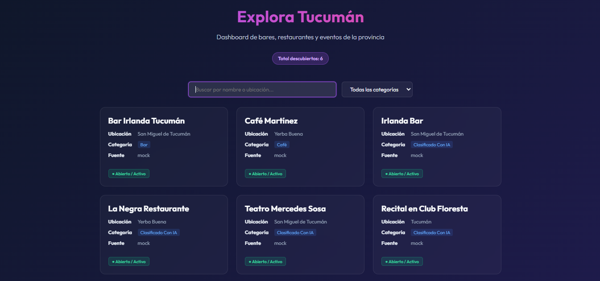
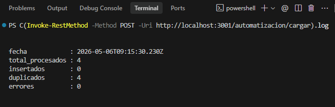
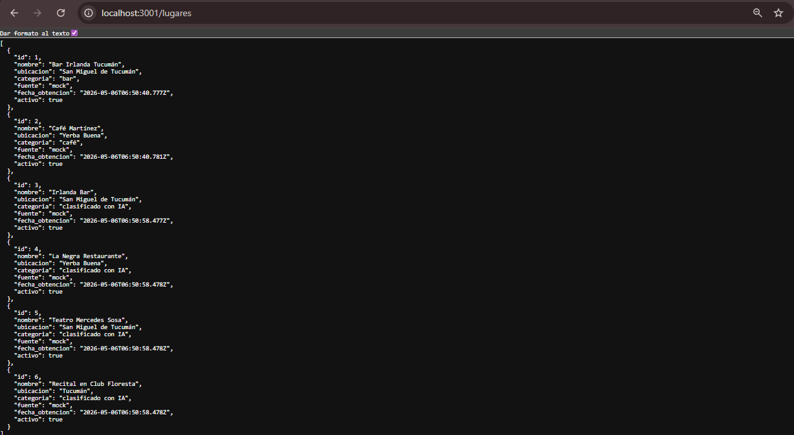

# Explora Tucumán

Dashboard automatizado para gestión de bares, restaurantes y eventos de Tucumán.

Sistema desarrollado como prueba técnica utilizando automatización, procesamiento de datos, clasificación automática, detección de duplicados y visualización web interactiva.

---

# Capturas

## Dashboard principal



## Logs de automatización



## Endpoint API



---

# Tecnologías utilizadas

## Backend
- Node.js
- Express

## Frontend
- React

## Automatización
- Script automatizado de carga de datos
- Procesamiento automático de registros
- Generación de logs

## IA aplicada
- Clasificación automática de categorías
- Detección básica de duplicados
- Normalización de datos

---

# Funcionalidades

- CRUD de lugares/eventos
- Dashboard web interactivo
- Búsqueda y filtrado
- Carga automática de datos
- Detección de duplicados
- Clasificación automática
- Logs de ejecución
- Datos mock simulando fuente externa

---

# Parte 1 — Obtención de datos

Se utilizó un dataset mock (`mock-data.json`) como simulación de una fuente externa.

Esto permite:

- evitar scraping agresivo
- mantener estabilidad durante las pruebas
- simular una API/dataset real

Campos utilizados:

- nombre
- ubicación
- categoría
- fuente
- fecha de obtención

---

# Parte 2 — CRUD

Endpoints implementados:

## Obtener lugares

```http
GET /lugares
```

## Crear lugar

```http
POST /lugares
```

## Editar lugar

```http
PUT /lugares/:id
```

## Desactivar lugar

```http
DELETE /lugares/:id
```

La eliminación se realiza de forma lógica mediante el campo:

```json
"activo": false
```

---

# Parte 3 — Automatización

Se implementó un flujo automatizado/script que permite:

1. Leer datos externos
2. Procesar registros
3. Detectar duplicados
4. Insertar nuevos registros
5. Generar logs de ejecución

Endpoint utilizado:

```http
POST /automatizacion/cargar
```

Ejemplo de log generado:

```json
{
  "fecha": "2026-05-06T06:23:49.062Z",
  "total_procesados": 4,
  "insertados": 4,
  "duplicados": 0,
  "errores": 0
}
```

Cada vez que se ejecuta el flujo:

- se consultan los datos mock
- se procesan automáticamente
- se agregan únicamente los registros nuevos
- se registran resultados de ejecución

---

# Parte 4 — Uso de IA

Se aplica IA basada en reglas para clasificar automáticamente lugares/eventos según su nombre.

Categorías detectadas:

- Bar
- Café
- Restaurante
- Evento cultural
- Recital
- Otro

También se contempla la detección de posibles duplicados mediante normalización de nombres.

Ejemplo:

- "Bar Irlanda Tucumán"
- "Irlanda Bar"

En futuras versiones, esta lógica podría reemplazarse por:

- OpenAI API
- embeddings semánticos
- similitud textual avanzada

---

# Parte 5 — Criterio técnico

## ¿Cómo se evitan duplicados?

Los nombres se normalizan utilizando:

- lowercase
- trim
- comparación textual

Luego se comparan los registros antes de insertarlos.

---

## ¿Cómo escalaría este sistema?

Posibles mejoras:

- PostgreSQL / MongoDB / Supabase
- APIs reales
- scraping automatizado
- integración con n8n
- cron jobs
- autenticación
- geolocalización
- IA real
- almacenamiento persistente

---

## Problemas posibles

- datos inconsistentes
- cambios en fuentes externas
- nombres ambiguos
- errores de scraping
- clasificación incorrecta

---

## ¿Cómo mejoraría la calidad de los datos?

- normalización de direcciones
- geolocalización
- validación manual
- historial de cambios
- aprobación de registros
- detección semántica de duplicados

---

# Dashboard

El frontend incluye:

- visualización moderna
- buscador
- filtros
- cards dinámicas
- categorías
- estados activos
- conexión en tiempo real con el backend

---

# Ejecución del proyecto

## Backend

```bash
cd backend
npm install
node server.js
```

Backend disponible en:

```txt
http://localhost:3001
```

---

## Frontend

```bash
cd frontend
npm install
npm start
```

Frontend disponible en:

```txt
http://localhost:3000
```

---

# Automatización

Ejecutar carga automática:

```powershell
Invoke-RestMethod -Method POST -Uri http://localhost:3001/automatizacion/cargar
```

Ver logs:

```powershell
(Invoke-RestMethod -Method POST -Uri http://localhost:3001/automatizacion/cargar).log
```

---

# Estado del proyecto

✅ Backend funcional  
✅ Frontend funcional  
✅ CRUD completo  
✅ Automatización implementada  
✅ IA aplicada  
✅ Logs de ejecución  
✅ Dashboard interactivo  

---

# Autor

Julieta Sleiman